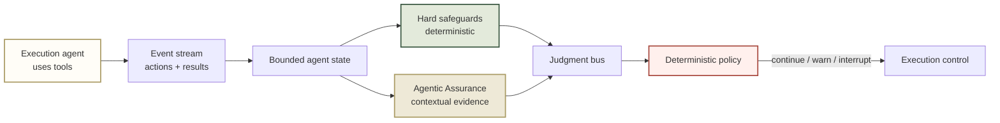

# Agent Assurance Plane

[](https://www.python.org/)
[](LICENSE)


**A runtime assurance layer for tool-using AI agents: it observes an execution agent independently, combines hard safeguards with Agentic Assurance, and makes the final control decision through a deterministic policy.**

> Observability tells you what an AI agent did.<br>
> **Agentic Assurance tells you whether it should have.**

This is not an agent framework and it is not an observability dashboard. It is
a small, runnable answer to a governance question:

> An agent has taken several actions. Is it still pursuing the user’s goal,
> has it crossed a known boundary, and who has authority to stop it?

The execution agent does not grade itself. Agent Assurance Plane observes its
event stream from the outside, emits structured evidence, and applies policy.
The demo uses a fictional checkout-latency investigation so the entire system
runs locally.

## The assurance spine

Three responsibilities stay separate by design:



The crucial boundary is between **Agentic Assurance** and **policy**:

- Agentic Assurance produces evidence, including probabilities.
- The policy engine is ordinary deterministic code with configured thresholds.
- Only policy produces an interrupt.
- Every judgment and policy result becomes part of the event timeline.

This prevents a probabilistic model from quietly becoming the system’s
unaccountable control plane.

## What is being judged

AAP intentionally keeps hard guarantees and contextual evidence separate.
They answer different questions and should never be collapsed into one opaque
score.

| Hard safeguards | Agentic Assurance |
| --- | --- |
| Has the agent repeated the same tool too many times? | Is the agent still aligned with the original goal? |
| Did it attempt a production mutation without approval? | Is it making meaningful progress? |
| Did it exceed a simulated budget? | Is the current tool appropriate? |
| Did it make a forbidden state transition? | Does the trajectory appear unproductively repetitive? |
| Known rule → known result | Bounded context → constrained, probabilistic result |

The UI presents these columns side by side at every step. A passing hard
safeguard means only that the agent did not violate that specific rule; it does
not prove that the work remains useful.

## Demo cases and expected evidence

| Scenario | What happens | Hard-safeguard result | Agentic Assurance contribution | Policy outcome |
| --- | --- | --- | --- | --- |
| `normal` | Metrics → traces → logs | Pass | Confirms relevant, productive work in live mode | Continue |
| `loop` | The same log query repeats | Repetition violation | Can independently flag an unproductive loop | Interrupt |
| `drift` | Valid tools move toward unrelated business questions | May remain green | Surfaces possible goal drift | Continue or warn, by threshold |
| `unsafe-mutation` | Unapproved restart attempt | Mutation violation | Supplementary evidence only | Interrupt |
| `forbidden-transition` | Impossible simulated environment change | Transition violation | Supplementary evidence only | Interrupt |
| `mixed` | Useful investigation later becomes repetitive | Repetition violation | Can flag declining productivity before the hard stop | Interrupt |

The offline evaluation suite runs all six trajectories. It records expected
violations, expected intervention, actual policy result, and
time-to-intervention without spending live API calls.

## A real control decision

The policy is intentionally easy to inspect:

| Evidence | Deterministic action |
| --- | --- |
| Any hard-safeguard violation | Interrupt |
| Agentic Assurance: high-confidence unproductive loop | Interrupt at configured threshold |
| Agentic Assurance: high-confidence goal misalignment | Warn at configured threshold |
| No trigger | Continue |

The policy is not hidden in prompts or scattered across the application. Its
inputs are typed `Judgment` records and its output is a typed
`PolicyDecision`. The operator can answer “why did it stop?” with a specific
rule or configured threshold, not a vague explanation.

## Quick start

### Prerequisites

- Python **3.11+**
- [uv](https://docs.astral.sh/uv/)
- Optional: a TypeSafe API key for live Agentic Assurance

```bash
git clone https://github.com/mailtotanvir/Agent-Assurance-Plane.git
cd Agent-Assurance-Plane
uv sync --extra dev

# Start the human-readable demo
uv run aap serve --port 8010
```

Open [http://127.0.0.1:8010](http://127.0.0.1:8010). The page begins with the
runtime process, then shows the policy outcome, then explains each agent step
with a neat hard-safeguards versus Agentic-Assurance comparison.

Run scripted cases from the terminal:

```bash
uv run aap demo normal
uv run aap demo loop
uv run aap demo mixed
uv run aap evaluate
```

### Optional live Agentic Assurance

The contextual adapter uses TypeSafe Jev. It is isolated from the rest of the
application, and all scripted demos, replay, and evaluation work without it.

```bash
export TYPESAFE_API_KEY=your-key

# Prove the adapter and typed response work
uv run aap jev-smoke

# Evaluate every scripted step with live contextual evidence
uv run aap demo drift --live-jev
```

Never commit a key. `.env` is ignored; `.env.example` contains only safe
variable names.

## What a run retains

Every run is a sequence of small, extensible events:

| Event | Meaning |
| --- | --- |
| `TASK_STARTED` | Goal and execution begin |
| `TOOL_CALL` / `TOOL_RESULT` | The execution agent acted and observed a result |
| `JUDGMENT_EMITTED` | A hard safeguard or Agentic Assurance emitted evidence |
| `POLICY_DECIDED` | The deterministic policy chose continue, warn, or interrupt |
| `AGENT_INTERRUPTED` | Policy stopped execution |

A provider-neutral judgment contains:

```text
judge · dimension · decision · probability · confidence
evidence · severity · timestamp
```

This is why Jev is an adapter rather than a dependency that leaks throughout
the codebase. Future LLM, human, or verifier judges can produce the same
internal record and feed the same policy.

## Replay and evaluation

Live calls are useful for an interactive demo, but reproducibility matters more
for assurance work. Persist a run and replay it without contacting any model:

```bash
uv run aap demo loop --output runs/example-loop.json
uv run aap replay runs/example-loop.json
uv run aap evaluate
```

Replay uses recorded contextual judgments; it never silently spends API calls.
The evaluation command is deliberately offline and reports whether each
scripted case produced the expected deterministic violations and intervention.

## Repository map

| Path | Responsibility |
| --- | --- |
| [`src/aap/models.py`](src/aap/models.py) | Provider-neutral events, judgments, state, and policy models |
| [`src/aap/runtime.py`](src/aap/runtime.py) | Scripted execution agent and assurance orchestration |
| [`src/aap/judges/deterministic.py`](src/aap/judges/deterministic.py) | Explicit hard safeguards |
| [`src/aap/judges/jev.py`](src/aap/judges/jev.py) | Narrow TypeSafe adapter |
| [`src/aap/policy.py`](src/aap/policy.py) | Deterministic control policy and thresholds |
| [`src/aap/replay.py`](src/aap/replay.py) | JSON persistence and offline replay |
| [`src/aap/evaluation.py`](src/aap/evaluation.py) | Six-scenario offline evaluation suite |
| [`src/aap/api.py`](src/aap/api.py) | Local FastAPI surface |
| [`web/`](web/) | Human-readable assurance timeline |
| [`BLOG_POST.html`](BLOG_POST.html) | Styled long-form publication draft for review |

## Safety boundary

This is a research/demo prototype, not a production authorization system.

- The simulated agent works only against fictional checkout-latency data.
- Secrets are read from environment variables and redacted before persistence
  or API responses.
- Local JSON persistence is sufficient for the prototype; there is no database,
  authentication layer, Kafka cluster, or cloud infrastructure.
- TypeSafe evidence is optional and bounded. The system does not send an
  unbounded event history.
- Production use would need workload-specific policy review, identity,
  authorization, failure handling, audit storage, and operator controls.

## Verification

```bash
uv run pytest
uv run ruff check .
uv run aap evaluate
```

The current suite contains **7 passing tests**, including deterministic loops,
unsafe mutations, API behavior, replay redaction, offline evaluation, and the
policy branch used by contextual warnings.

## License

[MIT](LICENSE)
